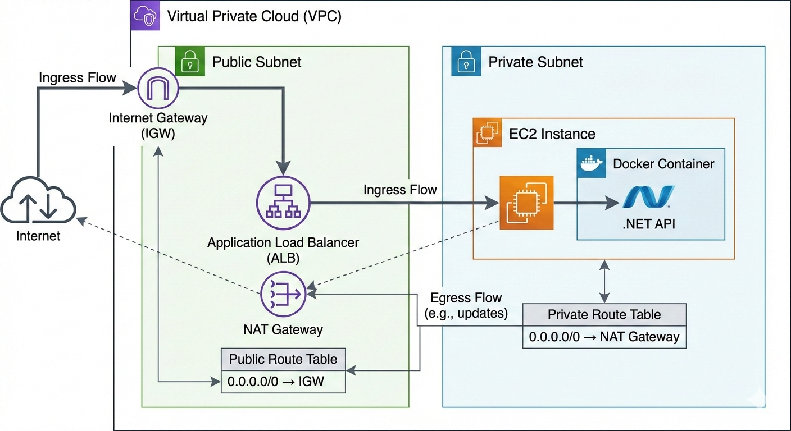

# Vertical Slice API – DevOps Project

This project demonstrates a real-world DevOps scenario where a .NET API,
built using Vertical Slice Architecture, is deployed on AWS using
Infrastructure as Code (Terraform) and containerization with Docker.

## Architecture

The infrastructure was designed following production-like best practices, focusing on security, scalabality and separation of concerns.

The creation was made following the diagram made below.

## Infrastructure

All infrastructure is provisioned using Terraform (Infrastructure as Code).

### AWS Resources:
- Custom VPC
- Public and Private Subnets
- Internet Gateway
- NAT Gateway (for private subnet outbound access)
- Route Tables
- Security Groups
- EC2 Bastion Host (public subnet)
- EC2 Backend Instance (private subnet)
- Application Load Balancer (ALB)
- Target Group with Health Checks

## Network & Security

- The backend EC2 instance runs inside a private subnet
- No direct internet access to the backend
- Access is routed through an Application Load Balancer
- A Bastion Host is used for SSH access when needed
- Security Groups allow traffic only from trusted sources (ALB → Backend)

## Application & Containerization

- The API is built with .NET and follows Vertical Slice Architecture
- The application is containerized using Docker
- Docker images are published to Docker Hub
- The container runs inside the private EC2 instance

Docker Image:
papaart/verticalslicearchitecture:latest

## Vertical Slice Architecture

The application follows the Vertical Slice Architecture pattern, where:

- Each feature is isolated
- Business logic is grouped by use case
- Low coupling between features
- Better maintainability and scalability

## How to Run

1. Clone the repository
2. Configure AWS credentials
3. Initialize Terraform:

terraform init

4. Apply the infrastructure:

terraform apply

5. The Application Load Balancer DNS will be output after deployment

**It's necessary to put the name of your key pair and also your ip address**

## Cost Management

After testing and validation, the infrastructure can be safely destroyed
to avoid unnecessary cloud costs:

terraform destroy

All resources are fully reproducible using Terraform.

## Learnings

- End-to-end DevOps workflow
- AWS networking fundamentals
- Infrastructure as Code with Terraform
- Secure backend exposure using ALB
- Containerized application deployment
- Production-oriented architecture decisions

## Final Notes

This project was built with a strong focus on real-world DevOps practices,
aiming to bridge the gap between learning and production-ready environments.
